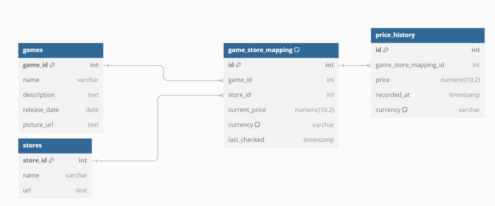

## Tables and Their Purpose

### 1. **Games**
- Central entity storing metadata for video games.
- Includes name, description, release date, and a picture URL.
- Each game can be linked to multiple stores.

### 2. **Stores**
- Includes store name and URL.
- Allows easy addition of new stores as needed.

### 3. **Game-Store Mapping**
- Junction table linking games to stores.
- Tracks the current price of a game on a specific store and when the price was last checked.
- Supports many-to-many relationships between games and stores.

### 4. **Price History**
- Tracks historical prices for games on specific stores.
- Provides insights into price trends over time.

## Relationships
1. A game can be available on multiple stores (many-to-many relationship).
2. Each store can offer multiple games (many-to-many relationship).
3. Historical prices are linked to specific game-store combinations.